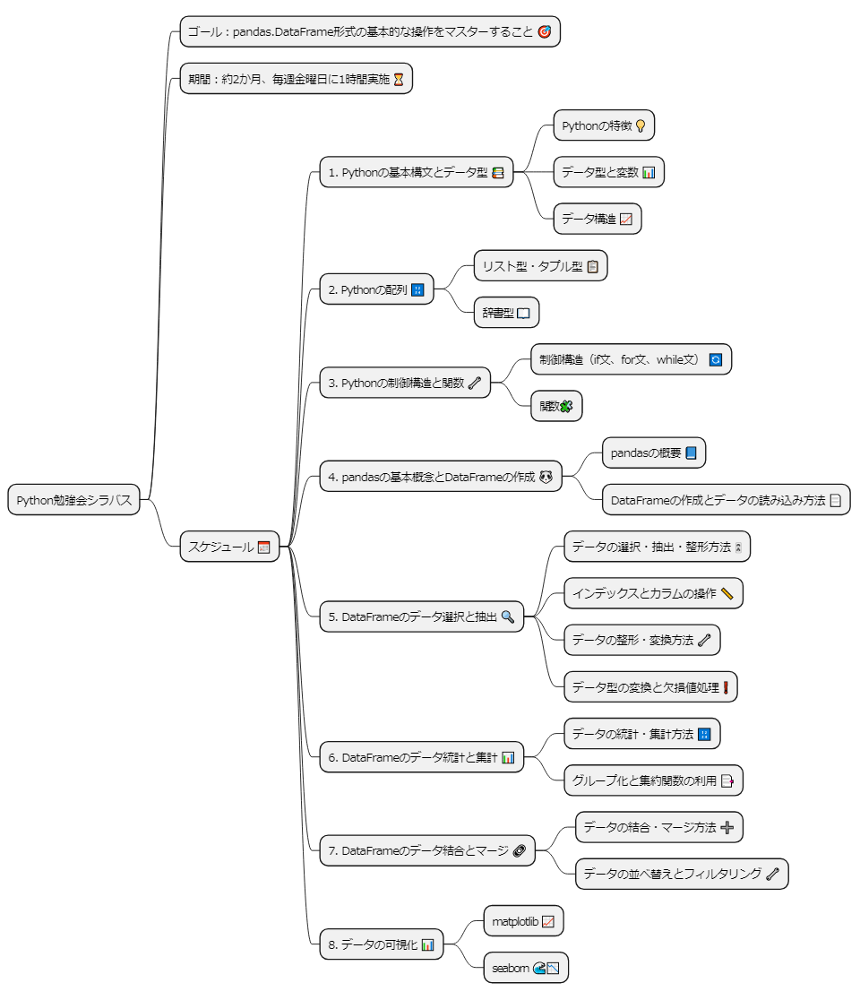

# C4RA Python勉強会資料

## ★ 勉強会の基本方針
### 概要
* 5月12日(金)から6月30日(金)までの計8回を予定しています。
* 目標は**pandas.DataFrame形式の基本的な操作をマスターすること**です。

### 使用環境
* 環境はGoogle Colaboratory(通称Colab)を使用します。Googleアカウントをご用意ください。
  * 各々のローカル環境でも実行可能です。
* 一部、東京大学「Pythonプログラミング入門」の教材を共有しながら勉強会を進めます。
  * 勉強会では**東大教材**と呼びます
  * URL：https://utokyo-ipp.github.io/index.html
* Colab（Jupyter Notebook）の詳しい使い方について、勉強会の中で深入りはしません
  * Colab立ち上げのURL：https://colab.research.google.com/
  * 便利なショートカット：https://blog.kikagaku.co.jp/google-colaboratory-shortcut

### 質問等
* Pythonに関する不明点があれば森木(Pumble,Mail,Twitter等)までご連絡ください
* 勉強会の内容でなくてもOKです（Colabの使い方や環境構築なども）

### シラバス
* 勉強会開始当初の想定です。変更が生じる場合があります。

| 日付    | タイトル                               |
|--------|--------------------------------------|
| 5月12日 | [Pythonの特徴とデータ型](./0512/0512_Tutorial.ipynb) |
| 5月19日 | [配列](./0519/0519_Tutorial.ipynb)              |
| 5月26日 | [制御構造と関数](./0526/0526_Tutorial.ipynb)     |
| 6月2日  | [pandasの概要とファイル入出力](./0602/0602_Tutorial.ipynb) |
| 6月9日  | DataFrameのデータ抽出と選択・整形 |
| 6月16日  | DataFrameのデータ統計と集計 |
| 6月23日  | DataFrameのデータ結合・マージ |
| 6月30日  | データ可視化 |

  
### シラバス(全体マップ)
